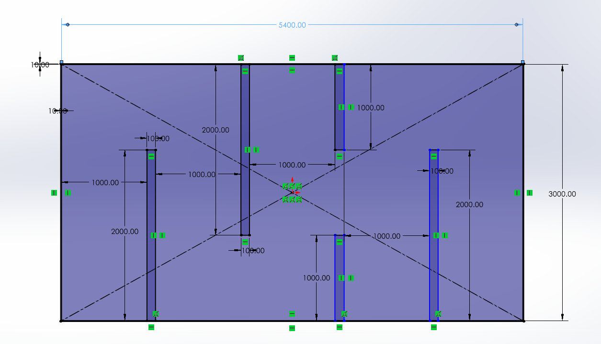
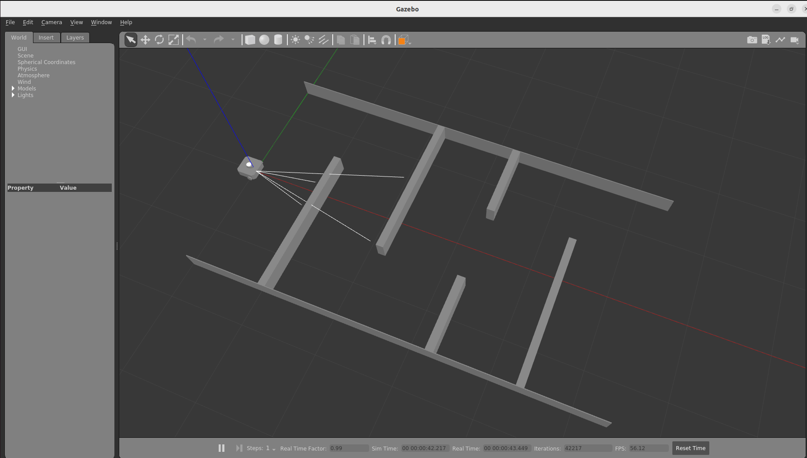

# ENPM 661: Path Planning for Autonomous Robots
### Instructions for Project3- Phase2

## Map Dimensions

All dimensions are in milimeters.



## Setup

Create a workpace

```sh
mkdir -p project3_ws/src
cd ~/project3_ws/src
```

Clone the reposiory

```sh
git clone https://github.com/koustubh1012/turtlebot3_project3.git
```

Source ROS (Enable ROS commands)

```sh
source /opt/ros/galactic/setup.bash
```

Build the workspace

```sh
cd ~/project3_ws
colcon build --packages-select turtlebot3_project3
```


Source ROS (Package will be identified)

```sh
source install/setup.bash
```

## Test Setup

Launch Environment

```sh
ros2 launch turtlebot3_project3 competition_world.launch
```

You should see the turtlebot3 along with the maze in gazebo



Explore Topics

```sh
ros2 topic list
```

Publish to topic (cmd_vel)

```sh
ros2 topic pub \cmd_vel geometry_msgs/msg/Twist "linear:
  x: 0.1
  y: 0.0
  z: 0.0
angular:
  x: 0.0
  y: 0.0
  z: 0.1"
```

## Write a script

We have provide a script fro reference in [teleop.py](/scripts/teleop.py)

You can run the script using

```sh
ros2 run turtlebot3_project3 teleop.py
```

## Add new Python executable

* Write a new python script and store it in a folder
* Update the CMakeLists.txt file 

```xml
# Install python scripts

install(PROGRAMS 
  scripts/teleop.py
  # You can add more scripts here
  DESTINATION lib/${PROJECT_NAME}
)

```

* Build the package
* Source the install folder
* Run the executable

```sh
ros2 run turtlebot3_project3 teleop.py
```


# Error

* Pynput Module Not Found

```sh
pip install pynput
```
