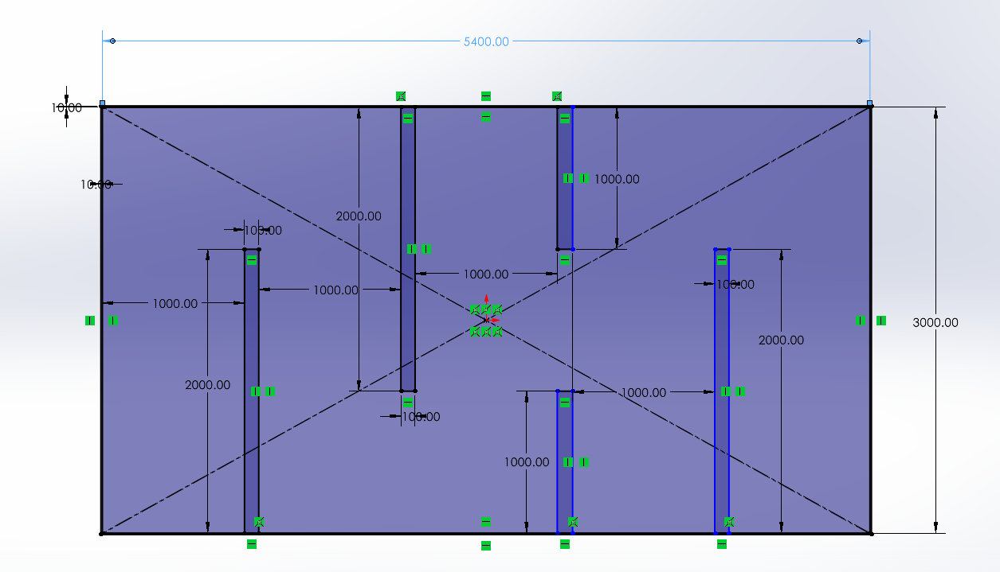
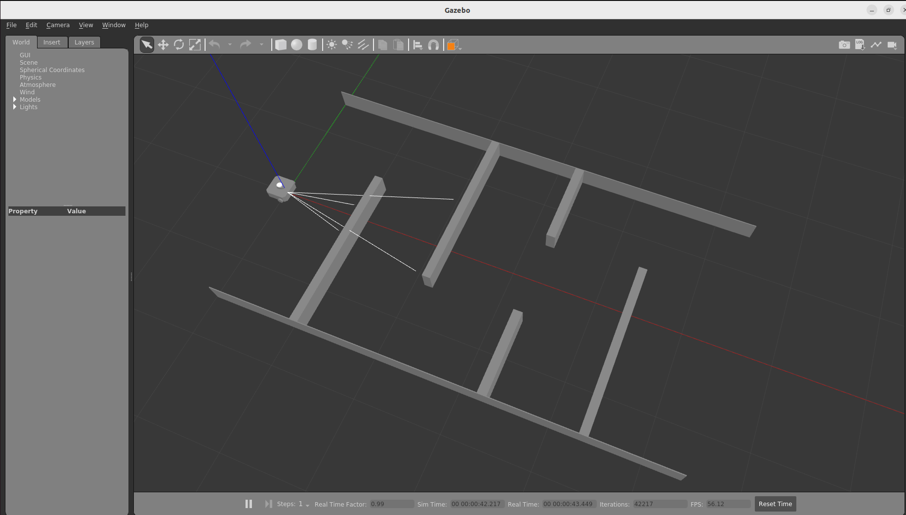

# ENPM 661: Path Planning for Autonomous Robots
### Instructions for Project3- Phase2

### Students:

1) Siddhant Pramod Deshmukh (121322463) Directory ID:iamsid
2) Pon Aswin Sankaralingam (121322517) Directory ID:aswin03
3) Venkata Madhav Tadavarthi (121058768) Directory ID:vmadhav

### Repository:
https://github.com/siddhant-code/PathPlanning.git

## Part-1
Go to the directory and run:

```sh
python3 a_star.py
```sh

Example inputs:
```
Give a value for clearance (mm) with consideration of robot radius:20
```

After this a worskpace map will be generated, close that map window. And you will be asked:

```
Enter the start coordinates in the form x (cm),y (cm),theta(radian): 0,0,0

Enter the goal coordinates in the form x (cm),y (cm): 550,0

Enter the 2 wheel RPM values in rad/s in the form rpm1,rpm2: 30,50
```
## Note:

1.If you give higher rpms, make the clearance higher.
2.Have minimal differences between rpms.(High rpm - low rpm =20 approx)

## Part-2A

## Map Dimensions

All dimensions are in milimeters.




## Clone the reposiory

```sh
git clone https://github.com/siddhant-code/PathPlanning.git
```

## Install ROS2 Humble (If not already installed)
Follow [this guide](https://docs.ros.org/en/humble/Installation.html) Then install colcon:

```sh
sudo apt install python3-colcon-common-extensions
```

## Build the workspace

```sh
cd path_planning_algorithms/astar/Phase2/project3_ws/
source /opt/ros/humble/setup.bash
colcon build
source install/setup.bash
```


## Test Setup

Launch Environment

```sh
export TURTLEBOT3_MODEL=waffle
ros2 launch turtlebot3_project3 competition_world.launch.py
```

You should see the turtlebot3 along with the maze in gazebo



Open another terminal:

```sh
cd path_planning_algorithms/astar/Phase2/project3_ws/
source /opt/ros/humble/setup.bash
source install/setup.bash
ros2 run turtlebot3_project3 controller.py
```

Example inputs:
```
Give a value for clearance (mm) with consideration of robot radius:20
```

After this a worskpace map will be generated, close that map window. And you will be asked:

```
Enter the start coordinates in the form x (cm),y (cm),theta(radian): 0,0,0

Enter the goal coordinates in the form x (cm),y (cm): 550,0

Enter the 2 wheel RPM values in rad/s in the form rpm1,rpm2: 30,50
```
## Note:

1.If you give higher rpms, make the clearance higher.
2.Have minimal differences between rpms.(High rpm - low rpm =20 approx)

# Error

* Pynput Module Not Found

```sh
pip install pynput
```

## Part-2B

## Introduction:

Implementing A* Algorithm to find a path between the start and end point on a given map for Turtlebot 3 in Falcon simulator.

## Dependencies:

You require the following libraries to work with the python code:

- numpy
- matplotlib
- sympy
- math
- queue
- moviepy
- time
- opencv

You can install these libraries by:

```
pip install <library_name>
```

## Usage

Clone or download the repository

```
git clone https://github.com/siddhant-code/PathPlanning.git
```

## Installation and setup 

Make sure Falconsim and ROS2 is installed in your system.

## Falcon Setup

Create a Falcon Account
Download [FalconSim](https://falcon.duality.ai/auth?destination=/secure/downloads) for Ubuntu 5.1
```
cd ~/Downloads
sudo apt install ./FalconSim_Linux_Ubuntu22_v5.1.0216.deb
```

## Install ROS2 Humble (If not already installed)
Follow [this guide](https://docs.ros.org/en/humble/Installation.html) Then install colcon:

```
sudo apt install python3-colcon-common-extensions
```


## Setup ROS2 Workspace

You should have the Scenarios and Twins folder at the same level of ROS2 package in your working directory.

Download the AMRPathPlanning scenario from Falcon Cloud (login required using your Falcon EDU credentials):
[Download Here](https://falcon.duality.ai/auth?destination=/secure/scenarios/edit/a265f262-d751-452f-83f6-9713ef4f9c10)
Unzip the downloaded folder.
Place the unzipped AMRPathPlanning folder inside your Scenarios/ folder.

Link to download [Twin](https://drive.google.com/drive/folders/1fqnezgb9rzdQJmdwOO4AGXci_xRFAE8B?usp=sharing) folder

Your final folder structure should look like this:

```
AStarPlanningProject/
├── ROS2/
│   └── falcon_turtlebot3_project_ws/
├── Scenarios/
│   └── AMRPathPlanning/
│       ├── AMRPathPlanning.usda
│       ├── AMRPathPlanning.py
│       └── Paks/
│           └── <*.pak file>
├── Twins/
│   └── (Environment + TurtleBot Twin files)
├── slides/
└── README.md
```
Update Launch File Paths
location: ROS2/falcon_turtlebot3_project_ws/src/astar_falcon_planner/launch/ros_falcon_astar.launch.py

```
ros_falcon_astar.launch.py
```

Edit ros_falcon_astar.launch.py:

Update cwd= to your FalconSim install path (e.g., /home/username/duality/falconsim/)
Update scenario= to the full path of AMRPathPlanning.usda
```
cd path_planning_algorithms/astar/Phase2/falcon_simulation/ROS2/falcon_turtlebot3_project_ws/
source /opt/ros/humble/setup.bash
colcon build
source install/setup.bash
```

## Launch Simulation
Use the command below to launch your simulation.

All values must be filled in by you based on your planning map and robot configuration.

```
ros2 launch astar_falcon_planner ros_falcon_astar.launch.py     start_position:=[0.0,0.0,0.0]     end_position:=[5.2,0.0,0.0]     robot_radius:=0.22     clearance:=0.22     delta_time:=1.0     wheel_radius:=0.033     wheel_distance:=0.287     rpms:=[50.0,100.0]
```
Note: Starting position should be 0,0,0 for falcon as they have spawning position set to that in their respective launch files. If one has to change spawn position,they have to edit the location in AMRPathPlanning.usda and use the same for path planning.

We also added static_tf_node to the launch file because we faced transform mapping error.

## Instructions

When you run the program, the falconsim window will be opened and then it will first display the workspace map showing the obstacles, wall and the clearance region.

After viewing the map, close the window and wait for some time to let the program generate the path.Once the path is generated successfully, you can visualize the robot moving in falconsim window.

## Video link: 

https://drive.google.com/drive/folders/1SchzSdAjJbw0uvH4HE2pZC138yKPgtiM
