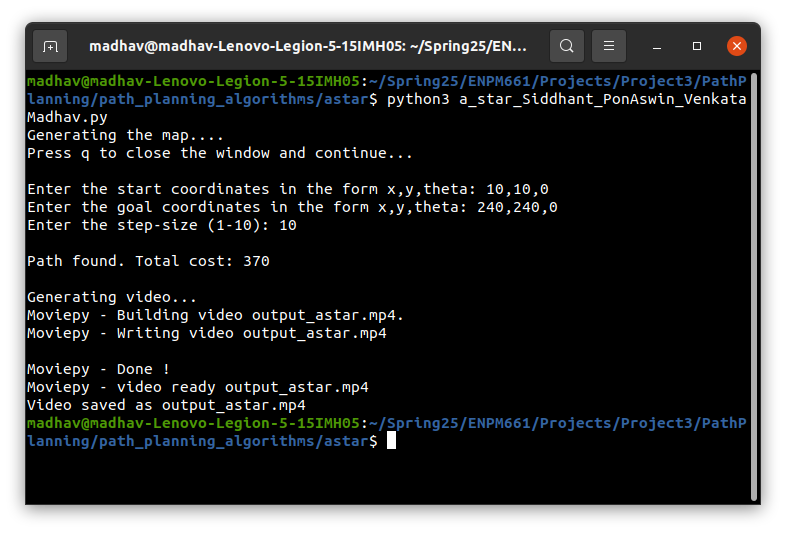

# ENPM 661 - Planning for Autonomous Robots
## Project-3: Phase-1

### Students:

1) Siddhant ()
2) Pon Aswin Sankaralingam ()
3) Venkata Madhav Tadavarthi (121058768)

## Introduction:

Implementing A* Algorithm to find a path between the start and end point on a given map for a mobile
robot.

## Dependencies:

You require the following libraries to work with the python code:

- numpy
- matplotlib
- sympy
- itertools
- math
- queue
- moviepy
- time
- opencv

You can install these libraries by:

```
pip install <library_name>
```

## Usage

Clone or download the repository

```
git clone https://github.com/siddhant-code/PathPlanning.git
```

Go to the A* folder:

```
cd path_planning_algorithms/astar/
```

You can run the python file by the following command:

```
python3 a_star.py
```

## Instructions

When you run the program, it will first display the workspace map (250x600) showing the obstacles, wall and the clearance region.


After viewing the map, press Q key to close the window and continue.

### User Input:

- Start Position: ($x_s,y_s,\theta_s$) 
    - "Enter the start coordinates in form x,y,theta: "

- Goal Position: ($x_g,y_g,\theta_g$) 
    - "Enter the goal coordinates in form x,y,theta: "

- Step-size: ($1 < 10 < 10$)
    - "Enter the step size: "

### Example:


